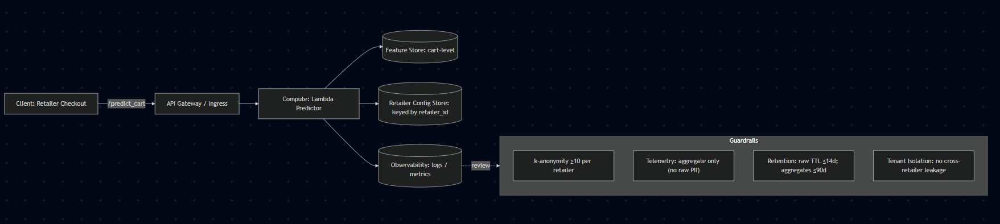

## Cart Abandonment Predictor

### 1) User & Decision

User: Marketing/retention teams across different e-commerce retailers (multi-tenant SaaS offering)

Decision: Trigger a retention strategy (send reminder email, pop-up discount, etc.).

### 2) Target & Horizon

Target: Will this cart be purchased (1) or abandoned (0)?

Horizon: Next 24 hours after last cart activity.

### 3) Features (No Leakage)

- Cart value (total $).
- Number of items.
- Time since last activity.
- Device type (mobile/desktop).
- Shipping speed

Site level features:

- If site requires an account in order to purchase products ([High inidcator of cart abandonment](https://baymard.com/lists/cart-abandonment-rate)) - Binary flag (1=yes, 0=no)
- Shipping speeds offered
- Payment options available

Exclusions: payment status (leaks future), any info after checkout event, data from other retailers (each client only sees its own predictions)

### 4) Baseline → Model Plan
Baseline: Predict “abandoned” for all carts below $20 value.

Model: Logistic regression

- Binary classification
- Each feature is assigned a weight -> simple and interpretable model to explain to stakeholders
- Low latency inference (matrix multiply)
- Easy to deploy
- Captures interaction effects (e.g., large cart AND long inactivity may be more likely to be highly abandoned)

Other models considered:

- Decision trees: More flexible, but doesn't capture interactions as well, less interpretable, and may overfit on small data
- Random forests Stronger, but heavier to train/serve and so is likely overkill for this project

Baseline and logistic regression are applied per-retailer, but trained to generalize across multiple stores. Guardrails ensure no leakage between tenants.

Hypothesis: Logistic regression will outperform the baseline by combining multiple weak predictors (cart value, item count, inactivity, device type) rather than relying on a single rule.

### 5) Metrics, SLA, and Cost
Metric(s): AUC-PR/MAE/etc. State why they fit harms/benefits.  
SLA: p95 latency, max cost per 10k predictions.

Metric: AUC-PR ([abandonment is more frequent](https://www.statista.com/statistics/477804/online-shopping-cart-abandonment-rate-worldwide/), so class imbalance).

SLA: p95 latency < 100 ms; cost ≤ free tier under 100 requests/day.

- Logistic regression + precomputed features should keep the API relatively fast and meet this threshold

Cost Envelope:

- 100 req/day → within free tier (AWS Lambda + DynamoDB).
- 50k req/hour spike → autoscaling serverless compute + caching, expected <$1 per 10k predictions.

Multi-tenant note: Predictions are isolated per retailer; no retailer’s data is exposed to others.

### 6) API Sketch

**Endpoint:**  
`POST /predict_cart`

**Request (JSON):**
```json
{
  "retailer_id": "store_12345",
  "cart_value": 45.99,
  "item_count": 3,
  "inactivity_hours": 12,
  "device_type": "mobile",
  "shipping_speed": "standard",
}
```

**Response (JSON):**
```json
{
  "prediction": "abandoned",
  "probability": 0.78,
  "retailer_id": "store_12345"
}
```

Notes: 
- prediction is binary: "abandoned" or "purchased".
- probability = model confidence (0.0–1.0).
- retailer_id ensures multi-tenant isolation (no cross-retailer leakage).

**Endpoint:**  
`POST /retailer`
```json
{
  "retailer_id": "store_12345",
  "requires_account": true,
  "payment_options": ["credit_card", "paypal"],
  "shipping_speeds": ["standard", "express"]
}
```

**Endpoint:**  
`GET /retailer/{id}`
```json
{
  "retailer_id": "store_12345",
  "requires_account": true,
  "payment_options": ["credit_card", "paypal"],
  "shipping_speed": "standard",
  "last_updated": "2025-09-14T10:45:00Z"
}
```

**Endpoint:**  
`PATCH /retailer/{id}`
```json
{
  "requires_account": false
}
```

Notes:

- Retailer configs are managed separately (efficient, scalable).  
- `/predict_cart` stays lightweight (cart-level only).
- Features such as `requires_account` are site-level and constant per retailer, cached for efficiency.

### 7) Privacy, Ethics, Reciprocity (PIA excerpt)
Data inventory, purpose limitation, retention, access (link your PIA).  
Telemetry decision matrix (value vs invasiveness vs effort).  
Guardrails: k-anonymity, jitter/aggregation, opt-ins, disclosure.  
Reciprocity: value returned and to whom.

---

### 8) Architecture Sketch (1 diagram)



**Architecture Diagram Code:**  
```
flowchart LR
  A[Client: Retailer Checkout] -->|/predict_cart| B[API Gateway / Ingress]
  B --> C[Compute: Lambda Predictor]
  C --> D[(Feature Store: cart-level)]
  C --> E[(Retailer Config Store: keyed by retailer_id)]
  C --> G[(Observability: logs / metrics)]

  subgraph Guardrails
    H["k-anonymity ≥10 per retailer"]
    I["Telemetry: aggregate only (no raw PII)"]
    J["Retention: raw TTL ≤14d; aggregates ≤90d"]
    K["Tenant Isolation: no cross-retailer leakage"]
  end

  G -. review .-> Guardrails
```


**Trade-offs & Alternatives**

- **Serverless (Lambda)**  
  - Good: Grows easily from a few requests to a big spike (cheap/free at small scale).  
  - Bad: Can be slow at the very first request if the system is “cold.”  

- **Containers (ECS/Kubernetes)**  
  - Good: Always ready (no “cold start”), more control over how it runs.  
  - Bad: More work to manage, more cost when traffic is low.  

- **Hybrid**  
  - Mix of both: mostly serverless, but keep a few containers “warm” for speed during spikes.  
  - Cache retailer settings in memory for speed; go back to the database only if needed.  

- **Feature Store**  
  - Option 1: Calculate features (like inactivity time) right when the request comes in → simple, but adds a tiny bit of delay.  
  - Option 2: Pre-calculate and store them → faster responses, but more moving parts and harder to keep up-to-date.  
  - Chose option 1 for the simpler design and since logistic regress is quick anyway

- **Retailer Config**  
  - Good: Stored once per retailer, easy to look up, no need to send the same info (like `requires_account`) every time.  
  - Alternative: Put all retailer info in every `/predict_cart` call → simpler design, but wastes bandwidth and could get inconsistent.  
 


### 9) Risks & Mitigations

**1. Misfire risk (false positives/negatives)**  
- Risk: Model predicts “abandoned” when the cart would have been purchased (false positive), or misses true abandonments (false negative).  
- Mitigation/Test: Evaluate precision and recall offline. Acceptance test = precision ≥ set threshold (e.g., 0.70) at chosen operating point.  

**2. Tail latency risk**  
- Risk: Most requests are fast, but a small % take too long (e.g., cold starts in serverless).  
- Mitigation/Test: Run a load test with 1,000 synthetic requests, measure p95 latency. Acceptance test = p95 < 100 ms.  

**3. Cost drift under viral spikes**  
- Risk: Costs rise above budget when traffic jumps to 50k requests/hour.  
- Mitigation/Test: Estimate costs with serverless pricing calculators; acceptance test = <$1 per 10k predictions at surge load.


### 10) Measurement Plan

**Offline Model Evaluation**  

- Run logistic regression on historical cart data and compare AUC-PR vs baseline score. Expect logistic regression to outperform baseline by leveraging multiple features instead of one threshold.

**Latency SLA Test**  

- Simulate 1,000 `/predict_cart` requests with synthetic clients, record response times, then compute p95 latency.

**Cost SLA Test**  
- Estimate costs under different loads:  
  - **Normal load (100 req/day):** fits within AWS/GCP free tier quotas (Lambda + DynamoDB).  
  - **Viral spike (50k req/hour):** autoscaling serverless compute with caching expected to keep costs ≤ $1 per 10k predictions.  

**Multi-Tenant Isolation**  
- Confirm that predictions are isolated per `retailer_id`.  
- Run tests to ensure no data from one retailer can be accessed or inferred by another.

### 11) Evolution & Evidence
Link a git hash (or range/tag) that shows the design’s evolution (commits, README updates, diagrams).  
Insight memo link (3 insights), assumption audit, and Socratic log references.
